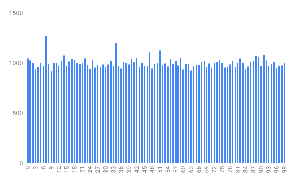

# race-rng

This is `race-rng`, a random number generator based on race conditions. Each thread manipulates a single `unsigned long long` using a Fibonacci-style PRNG, thus generating actual randomness.

It is designed to be easily configured with your own PRNG and other parameters.

Requirements:
* `pthreads` with `barriers`

Here is the distribution of random numbers running `race-rng` with 4 threads over 100,000 iterations. The essential call is `rng() % 100`.

